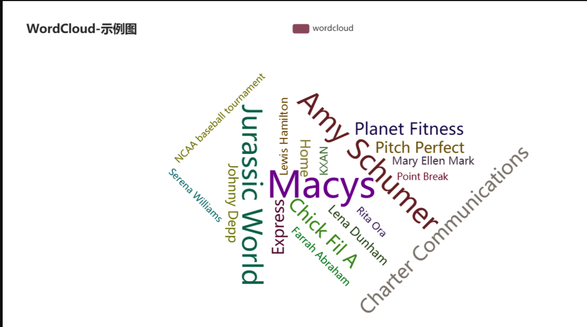

This post will talk about how we can use Golang to generate a wordgraph. In a previous [post](https://www.cameronroberts.dev/blog/golang-twitter-scraper/) we talked about how we can use the Twitter API to scrape tweets. We are going to build on that in this post by analalyzing those tweets to extract the most popular words and plotting that on to a wordgraph. If you haven't read that post then it might help out but if not don't worry we will cover the code in this tutorial.

### Prerequisites
- A valid Golang installation. If you don't have this then this is a good place to [start](https://golang.org/doc/install)
- Twitter developer account. https://developer.twitter.com/en/portal/dashboard
- Some basic programming knowledge but I'll do my best to explain the examples

### Twitter API key
If you haven't already got a developer account on Twitter you will need to sign up. The steps to do this are documented [here](https://developer.twitter.com/en/apply-for-access). 

Once you have an approved developer account head over to the [dashboard](https://developer.twitter.com/en/portal/dashboard) and create a new `Project`.

Take note of your API key, API key secret, access token, access token secret as we will need these in a few moments time.


### Project setup 

```bash
mkdir twitter-bot
cd twitter-bot
// Change this to your Github
go mod init github.com/cameronldroberts/golang-wordgraph
```


### 3..2..1.. Go!
Open the `golang-wordgraph` directory in your favourite text editor and create a file called `main.go`





